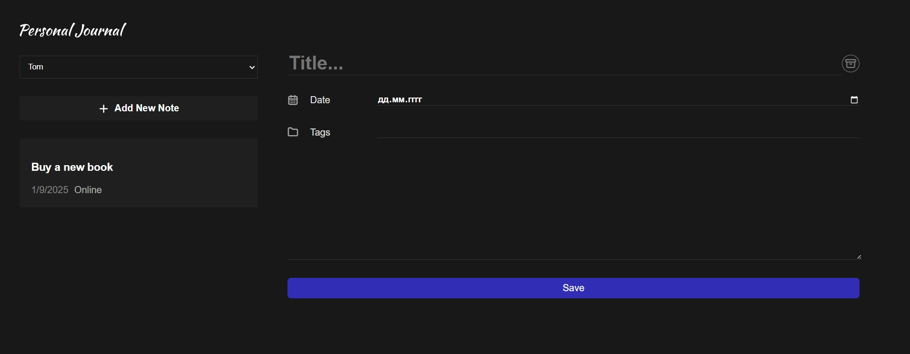

# Personal Journal Application

This project is a **Personal Journal Application** built using **React** and **Vite** (Javascript). The application allows users to create and manage notes and journal entries. It features a modern, dark-themed UI with a focus on simplicity and usability.



## Features

1. **User Selection**:
   - Dropdown to select or switch between different users.

2. **Add New Note**:
   - Button to add a new note.
   - Notes are saved with relevant metadata like date and tags.

3. **Dynamic Note List**:
   - Displays saved notes in a card-like structure.
   - Includes metadata such as the creation date and a short description (e.g., "Online").

4. **Customizable Note Form**:
   - Input fields for:
     - **Title**: Styled with a prominent font.
     - **Date**: Includes a calendar picker for date selection.
     - **Tags**: Allows categorization of notes.
		 - **Post**: Adds a short description of notes.
   - Save button for storing entries.

5. **Dark Themed UI**:
   - A sleek, dark mode interface for ease of use and aesthetics.

6. **React Context and Hooks**:
   - State management is handled via React Context and custom hooks.
   - The application uses local storage to persist data across sessions.

7. **Custom Components**:
   - Modular structure with reusable components:
     - **Input**: Handles various form inputs.
     - **JournalItem**: Displays individual journal entries.
     - **JournalForm**: Manages new journal entry creation.
     - **CardButton**: Provides styled buttons for actions.

8. **Vite Integration**:
   - Fast and optimized development environment powered by Vite.

---

## File Structure
```bash
src/
├── components/
│ ├── Button/
│ ├── CardButton/
│ ├── Header/
│ ├── Input/
│ ├── JournalAddButton/
│ ├── JournalForm/
│ ├── JournalItem/
│ ├── JournalList/
│ ├── Logo/
│ └── SelectUser/
├── context/
│ └── ... (Global state management)
├── hooks/
│ └── ... (Custom React hooks)
├── assets/
└── public/
```

- **components/**: Contains reusable UI components.
- **context/**: Includes React Contexts for managing global state.
- **hooks/**: Contains custom hooks, such as a hook for local storage management.
- **public/**: Houses static assets like icons and images.

---

## How to Run the Project

1. Clone the repository:
   ```bash
   git clone <repository-url>
   cd <repository-folder>
	 ```

2. Install dependencies:
   ```bash
	npm install
	 ```
3. Start the development server::
   ```bash
	npm run dev
	 ```
